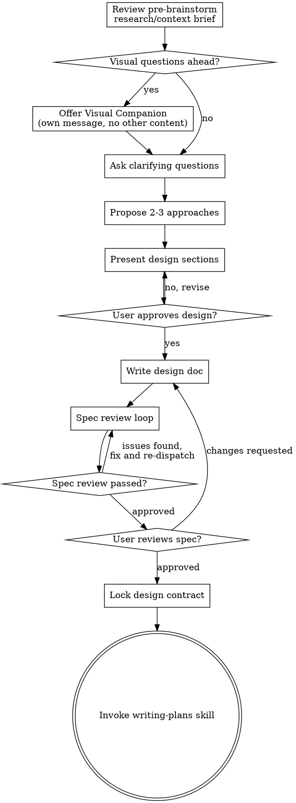

# Brainstorming Ideas Into Designs

Help turn ideas into fully formed designs and specs through natural collaborative dialogue.

This skill starts after a pre-brainstorm research/context brief has been gathered and shared. Start from that brief, then ask questions one at a time to refine the idea. Once you understand what you're building, present the design and get user approval.

<HARD-GATE>
Do NOT invoke any implementation skill, write any code, scaffold any project, or take any implementation action until you have presented a design and the user has approved it. This skill is for Feature-grade or confidence-low design work, not every request.
</HARD-GATE>

## Entry Condition

This skill normally comes after `graphenepowers:using-graphenepowers` routes work to `Feature`.

- `Micro` work should not come here
- `Small Task` work usually goes straight to `graphenepowers:writing-plans`
- `Feature` work comes here first
- if design confidence is low, the internal classification step may still send work here even when scope looks smaller

Support asset for the pre-brainstorm research/context brief:

- `brainstorming/context/research-context-brief-template.md`

Stage assets in this skill:

- `brainstorming/context/` - research/context brief inputs
- `brainstorming/review/` - spec review prompts
- `brainstorming/visual/` - browser companion guide and supporting scripts

## Required Input

Before starting brainstorming proper, prepare and share a pre-brainstorm research/context brief.

That brief should cover:

- related internal work
- latest external knowledge when time-sensitive facts matter
- implicit assumptions already in play
- background knowledge or domain constraints the design depends on
- extracted terminology, invariants, and heuristics
- useful mental models for decomposition or tradeoff reasoning
- open unknowns that still need clarification

If this brief is missing or materially weak, stop and fix that first. Do not jump into ideation from unexamined assumptions.

## Phase Boundary

`brainstorming` and `design contract` are distinct phases, but they belong to the same overall flow.

- `brainstorming` is the exploratory phase
  - refine goals, constraints, tradeoffs, and structure
  - keep alternatives open until the user approves the chosen direction
- `design contract` is the commitment phase
  - extract only the decisions planning and execution are allowed to rely on
  - lock interfaces, invariants, autonomy boundary, exception gates, and handoff evidence

Do not treat `design contract` as a separate public skill or a completely separate workflow. By default, it is the closing phase of `brainstorming`.

The separation is conceptual and operational:

- conceptual, because exploration and commitment serve different purposes
- operational, because `writing-plans` and `executing-plans` need a stable boundary they can trust

By default, keep both phases in the same spec document. Split them into separate documents only for unusually large or regulated `Feature` work.

## Checklist

You MUST create a task for each of these items and complete them in order:

1. **Confirm entry condition** — this is `Feature` work or design confidence is low
2. **Review the pre-brainstorm brief** — make sure the relevant precedents, assumptions, latest knowledge, and unknowns are explicit before asking design questions
3. **Offer visual companion** (if topic will involve visual questions) — this is its own message, not combined with a clarifying question. See the Visual Companion section below.
4. **Ask clarifying questions** — one at a time, understand purpose/constraints/success criteria
5. **Propose 2-3 approaches** — with trade-offs and your recommendation
6. **Present design** — in sections scaled to their complexity, get user approval after each section
7. **Write design doc** — save to `docs/graphenepowers/specs/YYYY-MM-DD-<topic>-design.md` and commit
8. **Spec review loop** — dispatch spec-document-reviewer subagent with precisely crafted review context (never your session history); fix issues and re-dispatch until approved (max 3 iterations, then surface to human)
9. **User reviews written spec** — ask user to review the spec file before proceeding
10. **Lock design contract** — confirm locked interfaces, invariants, autonomy boundary, exception gates, and handoff evidence
11. **Transition to implementation** — invoke `graphenepowers:writing-plans`

## Process Flow

**The terminal state is locking the design contract and then invoking writing-plans.** Do NOT invoke frontend-design, mcp-builder, or any other implementation skill. The ONLY skill you invoke after brainstorming is writing-plans.

## The Process

**Understanding the idea:**

- Start from the pre-brainstorm research/context brief rather than from raw intuition.
- Review the brief before ideation and make sure the relevant precedents, latest knowledge, assumptions, and unknowns are visible to the user.
- Use the brief to improve question quality. Ask questions after the frame is explicit, not before.
- If the brief reveals stale external knowledge, missing domain context, or ungrounded assumptions, pause brainstorming and strengthen the brief first.
- Before asking detailed questions, assess scope: if the request describes multiple independent subsystems (e.g., "build a platform with chat, file storage, billing, and analytics"), flag this immediately. Don't spend questions refining details of a project that needs to be decomposed first.
- If the project is too large for a single spec, help the user decompose into sub-projects: what are the independent pieces, how do they relate, what order should they be built? Then brainstorm the first sub-project through the normal design flow. Each sub-project gets its own spec → plan → implementation cycle.
- For appropriately-scoped projects, ask questions one at a time to refine the idea
- Prefer multiple choice questions when possible, but open-ended is fine too
- Only one question per message - if a topic needs more exploration, break it into multiple questions
- Focus on understanding: purpose, constraints, success criteria

**Exploring approaches:**

- Propose 2-3 different approaches with trade-offs
- Present options conversationally with your recommendation and reasoning
- Lead with your recommended option and explain why

**Presenting the design:**

- Once you believe you understand what you're building, present the design
- Scale each section to its complexity: a few sentences if straightforward, up to 200-300 words if nuanced
- Ask after each section whether it looks right so far
- Cover: architecture, components, data flow, error handling, testing
- Be ready to go back and clarify if something doesn't make sense

**Design for isolation and clarity:**

- Break the system into smaller units that each have one clear purpose, communicate through well-defined interfaces, and can be understood and tested independently
- For each unit, you should be able to answer: what does it do, how do you use it, and what does it depend on?
- Can someone understand what a unit does without reading its internals? Can you change the internals without breaking consumers? If not, the boundaries need work.
- Smaller, well-bounded units are also easier for you to work with - you reason better about code you can hold in context at once, and your edits are more reliable when files are focused. When a file grows large, that's often a signal that it's doing too much.

**Working in existing codebases:**

- Explore the current structure before proposing changes. Follow existing patterns.
- Where existing code has problems that affect the work (e.g., a file that's grown too large, unclear boundaries, tangled responsibilities), include targeted improvements as part of the design - the way a good developer improves code they're working in.
- Don't propose unrelated refactoring. Stay focused on what serves the current goal.

## After the Design

**Documentation:**

- Write the validated design (spec) to `docs/graphenepowers/specs/YYYY-MM-DD-<topic>-design.md`
  - (User preferences for spec location override this default)
- Record the pre-brainstorm research/context brief in the spec when it materially shaped the design, especially the implicit assumptions, external constraints, and mental models the plan will rely on
- Prefer a spec shape like:
  - context brief
  - design exploration
  - chosen approach
  - open questions or deferred concerns
  - design contract
  - planning handoff notes
- Use elements-of-style:writing-clearly-and-concisely skill if available
- Commit the design document to git

**Spec Review Loop:**
After writing the spec document:

1. Dispatch spec-document-reviewer subagent (see `review/spec-document-reviewer-prompt.md`)
2. If Issues Found: fix, re-dispatch, repeat until Approved
3. If loop exceeds 3 iterations, surface to human for guidance

**User Review Gate:**
After the spec review loop passes, ask the user to review the written spec before proceeding:

> "Spec written and committed to `<path>`. Please review it and let me know if you want to make any changes before we start writing out the implementation plan."

Wait for the user's response. If they request changes, make them and re-run the spec review loop. Only proceed once the user approves.

**Design Contract:**
Before handing off to planning for `Feature`, write or confirm the design contract:

- locked interfaces
- locked invariants
- autonomy boundary
- exception gates
- handoff evidence the human expects

If design is already stable enough when you enter `brainstorming`, do not force unnecessary exploratory churn. Confirm the design inputs, lock the contract, and move on.

**Implementation:**

- Invoke the writing-plans skill to create the implementation plan
- Use `windowed` planning mode for `Feature`
- Do NOT invoke any other skill. writing-plans is the next step.

## Key Principles

- **One question at a time** - Don't overwhelm with multiple questions
- **Multiple choice preferred** - Easier to answer than open-ended when possible
- **YAGNI ruthlessly** - Remove unnecessary features from all designs
- **Explore alternatives** - Always propose 2-3 approaches before settling
- **Incremental validation** - Present design, get approval before moving on
- **Be flexible** - Go back and clarify when something doesn't make sense

## Visual Companion

A browser-based companion for showing mockups, diagrams, and visual options during brainstorming. Available as a tool — not a mode. Accepting the companion means it's available for questions that benefit from visual treatment; it does NOT mean every question goes through the browser.

**Offering the companion:** When you anticipate that upcoming questions will involve visual content (mockups, layouts, diagrams), offer it once for consent:
> "Some of what we're working on might be easier to explain if I can show it to you in a web browser. I can put together mockups, diagrams, comparisons, and other visuals as we go. This feature is still new and can be token-intensive. Want to try it? (Requires opening a local URL)"

**This offer MUST be its own message.** Do not combine it with clarifying questions, context summaries, or any other content. The message should contain ONLY the offer above and nothing else. Wait for the user's response before continuing. If they decline, proceed with text-only brainstorming.

**Per-question decision:** Even after the user accepts, decide FOR EACH QUESTION whether to use the browser or the terminal. The test: **would the user understand this better by seeing it than reading it?**

- **Use the browser** for content that IS visual — mockups, wireframes, layout comparisons, architecture diagrams, side-by-side visual designs
- **Use the terminal** for content that is text — requirements questions, conceptual choices, tradeoff lists, A/B/C/D text options, scope decisions

A question about a UI topic is not automatically a visual question. "What does personality mean in this context?" is a conceptual question — use the terminal. "Which wizard layout works better?" is a visual question — use the browser.

If they agree to the companion, read the detailed guide before proceeding:
`skills/brainstorming/visual/visual-companion.md`
